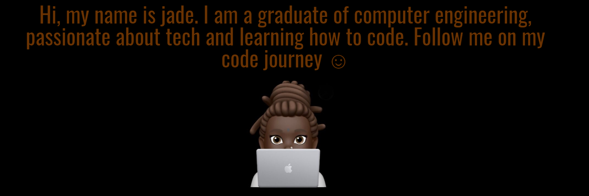

<!--  -->

<body>
  
# About Me
### Hi there👋🏾

 Here is arndom's ocoto-lang:

<!--
**jadesola123/jadesola123** is a ✨ _special_ ✨ repository because its `README.md` (this file) appears on your GitHub profile.

Here are some ideas to get you started:

- 🔭 I’m currently working on ...
- 🌱 I’m currently learning ...
- 👯 I’m looking to collaborate on ...
- 🤔 I’m looking for help with ...
- 💬 Ask me about ...
- 📫 How to reach me: ...
- 😄 Pronouns: ...
- ⚡ Fun fact: ...
-->

 My name is Jadesola, I am a content writer with interest in front-end development and data science.    I love reading tech articles and I love writing screenplays.  
Aside from tech and film, I also blog on medium and I have been published in "the startup" and " change your mind, change your life" publications on there.

Currently I am self teaching myself in html, css and Javascript and a little python🤭. I plan on using my Hashnode blog as a log for recording my coding journey. So feel free to follow me on Hashnode if you want to see how it goes 🤓🤓🤓

Some other things about me are: 

<ul>
<li>📺 my favorite shows to binge are gossip girl, ugly betty and desperate housewives.

<li>👩🏾Pronouns are she/her 

  
<li>I have a degree in computer engineering
  
  
<li>I currently work at an Internet service provider in Nigeria
  

<li>I really enjoy reality shows (even though they are fake)🌚🌚

<li>💆🏾‍♀️I love listening to asmr and burning incense, they help me relax.

<li>🎤 My favorite Dev podcasts are code newbie and the ladybug podcasts.

<li>🎬 My favorite movies of all time are lady bird, Brooklyn and brokeback mountain

</ul>

Follow me on 
<ul>
<li><a href="http://medium.com/@jadesolak.business" target="_blank">
Medium</a></li>
<li><a href="http://www.twitter.com/jadecodes" target="_blank">
Twitter</a></li>

<li><a href="mailto: Jadesolak.business@gmail.com">Email me</a></li>
</ul>

</body>

# 📩 Latest Blog Posts.
<!-- BLOG-POST-LIST:START -->
- [HNGInternship Chronicles: Task 1.](https://jadekareem.hashnode.dev/hnginternship-chronicles-task-1)
- [How to get experience for your resume as a junior developer](https://jadekareem.hashnode.dev/how-to-get-experience-for-your-resume-as-a-junior-developer-1)
- [Challenges I have Encountered on my Tech Journey.](https://jadekareem.hashnode.dev/challenges-i-have-encountered-on-my-tech-journey)
- [Why I Started my Tech Journey.](https://jadekareem.hashnode.dev/why-i-started-my-tech-journey)
- [Getting Started with the Raspberry Pi 3b](https://jadekareem.hashnode.dev/getting-started-with-the-raspberry-pi-3b)
<!-- BLOG-POST-LIST:END -->

## 📌Pinned Reposotries.
[)](https://github.com/jadesola123/github-readme-stats)

## My stats📈

## Top Languages. 

